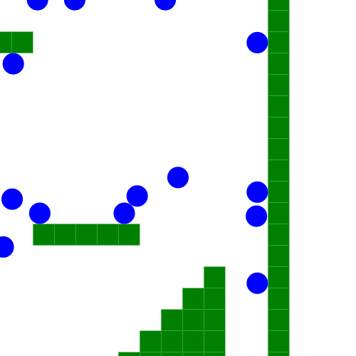

# collision-engine

A collision engine with entity-wall and entity-entity collisions.
Entity-entity collision is inspired by DeepNight [(http://deepnight.net/a-simple-platformer-engine-part-2-collisions/)](http://deepnight.net/a-simple-platformer-engine-part-2-collisions/ "A simple platformer engine (part 2): collisions")

